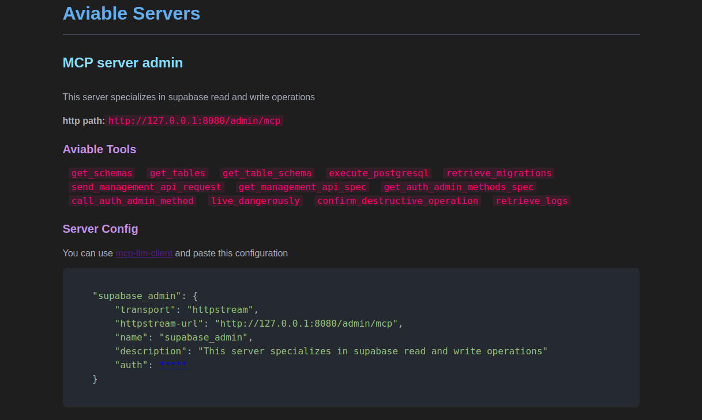

# Remote Servers

To use the following examples and deploy MCP servers, it is essential to have the `supabase-mcp-server` package installed. Refer to the [Install](../README.md#step-1-installation) section for installation instructions.

## MCP Servers Remote Host

### Httpstream

The **httpstream** protocol enables a clear separation between client and server, allowing for independent scalability. The httpstream server is implemented with `FastAPI`, following the steps in the [official MCP CLI documentation](https://github.com/modelcontextprotocol/python-sdk).

### Local Usage

For local deployment within this project, it is recommended to use the default configuration without modifying the source code. Default servers are defined in the [`servers.remote.json`](servers.remote.json) file, which can be customized or extended as needed. To start the httpstream server with the default configuration, run:

```shell
python3 supabase_mcp/remote/mcp_server.py --host 127.0.0.1 --port 8080 --oauth_url http://127.0.0.1:9080
```

For greater flexibility, it is advisable to [create your own project](#new-project) using the Supabase package, thus avoiding changes to the source code. For further questions, you may open a discussion in the `rb58853/supabas-mcp-server` repository.

### New Project

#### Default Servers

To implement MCP servers in a new project, you can use the default configuration, which simplifies the setup. Ensure your project root contains a `servers.remote.json` file with the following structure:

```json
{
    "expose_url": "http://127.0.0.1:8080",
    "servers": [
        {
            "name": "admin",
            "description": "This server specializes in Supabase read and write operations",
            "auth": false,
            "exclude_tools": []
        },
        {
            "name": "client",
            "description": "This server specializes in Supabase read and public operations",
            "auth": true,
            "exclude_tools": [
                "call_auth_admin_method",
                "execute_postgresql",
                "send_management_api_request",
                "confirm_destructive_operation",
                "live_dangerously",
                "get_auth_admin_methods_spec",
                "execute_postgresql"
            ]
        }
    ]
}
```

For a complete list of available tools, see [services.md](./aviable_services.md). This document provides the exact names to include in the `"exclude_tools"` key.

The `DefaultsServers` class automates the creation of MCP servers using this configuration. Example usage in a new project:

```python
# main.py
from supabase_mcp.remote.mcp_server import run as run_remote_server
import click

@click.command()
@click.option("--port", default=8080, help="Port to listen on")
@click.option("--host", default="127.0.0.1", help="Host to use")
@click.option(
    "--oauth_url", default="http://127.0.0.1:9080", help="OAuth server expose URL"
)
def main(port: int, host: str, oauth_url: str):
    run_remote_server(port=port, host=host, oauth_url=oauth_url)

if __name__ == "__main__":
    main()
```

To start the API, open a terminal in your project root and run:

```shell
python3 src/mcp_server.py --host 127.0.0.1 --port 8080 --oauth_url http://127.0.0.1:9080
```

#### Manual Servers

For more specific server configurations, use the [`ServerMCP`](supabase_mcp/remote/core/server_mcp.py) class and add them to your server, which can be created with the [`httpstream_api`](supabase_mcp/remote/core/fast_api/server.py) method. See [this example](https://github.com/rb58853/simple-mcp-server) and the [official documentation](https://github.com/modelcontextprotocol/python-sdk) for details.

```python
# ServerMCP

class ServerMCP:
    def **init**(
        self,
        name: str = "server",
        instructions: str = "This server specializes in Supabase read and write operations.",
        exclude_tools: list[ToolName] = [],
        transfer_protocol: str = "httpstream",
        auth_settings: AuthSettings | None = None,
        token_verifier: TokenVerifier | None = None,
    ):
    ...
```

#### Args

- `name (str)`: Name of the server. Defaults to "server".
- `instructions (str)`: Description of the server's purpose.
- `exclude_tools (list[ToolName])`: List of tools to exclude.
- `transfer_protocol (str)`: Transfer protocol used by the server.
- `auth_settings (AuthSettings | None)`: Optional authentication settings.
- `token_verifier (TokenVerifier | None)`: Optional token verifier.

---

```python
# httpstream_api
def httpstream_api(mcp_servers: list[ServerMCP]) -> FastAPI:
    ...
```

#### Args

- `mcp_servers (list[ServerMCP])`: List of MCP servers to be hosted in the FastAPI application.

---

Example of manual server creation:

```python
# main.py

from supabase_mcp.remote.core.server_mcp import ServerMCP, ToolName
from supabase_mcp.remote.core.fast_api.server import httpstream_api, FastAPI

my_server: ServerMCP = ServerMCP(
    name=name,
    instructions=instructions,
    exclude_tools=[
        ToolName.CALL_AUTH_ADMIN_METHOD,
        ToolName.EXECUTE_POSTGRESQL,
        ToolName.SEND_MANAGEMENT_API_REQUEST,
        ToolName.CONFIRM_DESTRUCTIVE_OPERATION,
        ToolName.LIVE_DANGEROUSLY,
        ToolName.GET_AUTH_ADMIN_METHODS_SPEC,
        ToolName.EXECUTE_POSTGRESQL,
        # ...
    ],
    auth_settings=my_oauth_settings,
    token_verifier=my_token_verifier
)

my_app: FastAPI = httpstream_api(mcp_servers=[my_server])
```

For guidance on creating authentication and token verifier variables, refer to the [mcp-oauth](https://github.com/rb58853/mcp-oauth) repository or the official source code at [modelcontextprotocol/python-sdk](https://github.com/modelcontextprotocol/python-sdk/tree/main/examples).

### Help

Once the FastAPI server is running, you can access a visual help interface by opening the host URL in your browser, for example: <http://127.0.0.1:8080>.



## OAuth Server

For authentication, the [mcp-oauth](https://github.com/rb58853/mcp-oauth) package is recommended, but you may use any OAuth system by providing its URL to the MCP servers.

#### In This Project

To start the OAuth server in this project, run:

```shell
python3 supabase_mcp/remote/oauth_server.py --host 127.0.0.1 --port 9080 --superusername <your-user-name> --superuserpassword <your-user-password>
```

#### In a Custom Installation

If you install the package, you can create a basic script to launch the OAuth server. Example:

```python
# oauth_server.py

from supabase_mcp.remote.oauth_server import run
import click

@click.command()
@click.option("--host", default="127.0.0.1", help="Host to use")
@click.option("--port", default=8080, help="Port to listen on")
@click.option("--superusername", default=None, help="")
@click.option("--superuserpassword", default=None, help="")
def main(
    host: str,
    port: int,
    superusername: str | None,
    superuserpassword: str | None,
):
    run(
        host=host,
        port=port,
        superusername=superusername,
        superuserpassword=superuserpassword,
    )

if **name** == "**main**":
    main()
```

To run it, assuming the file is located at `src/oauth_server.py`, use:

```shell
python3 src/oauth_server.py --host 127.0.0.1 --port 9080 --superusername <your-user-name> --superuserpassword <your-user-password>
```

---

Alternatively, you can implement your own authentication system and use it as needed, since MCP servers and the OAuth server are independent in both development and deployment.
