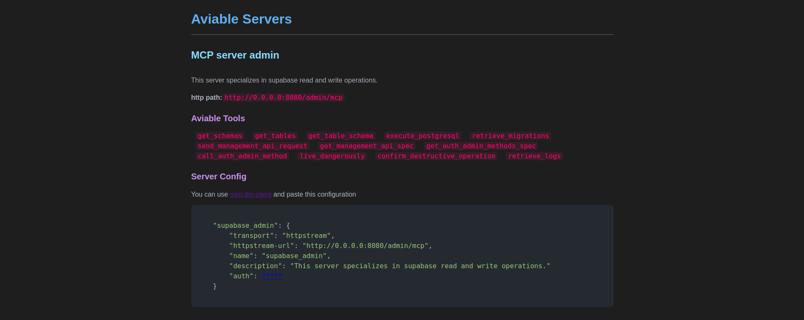

## Supabase In Docker Host (VPS user case)

Supabase no solo se levanta local o en el cloud oficial de supabase, tambien se puede levantar en docker hosteandolo con el [docker-compose.yml](https://github.com/supabase/supabase/tree/master/docker) de la pagina oficial de supabase. Este, por lo general, es un caso de uso usado para levantar supabase en un VPS o en cualquier contenedor de docker. Para este nuevo tipo de host se necesitaran algunos ajustes del `.env`. Se deben agregar las siguientes variables al entorno:

```env
# Docker Container Environment
CONTAINER_EXPOSE_IP=<your-vps-ip> #default >> 127.0.0.1

## DATABASE
DATABASE_NAME=postgres
DATABASE_USER=postgres

## POOLER
POOLER_PROXY_PORT_TRANSACTION=6543
POOLER_TENANT_ID=your-tenant-id
```

El IP de tu host, ya sea vps o localhost es un valor conocido por quien monta la app. Cada una de las otras variables `DATABASE_NAME`, `DATABASE_USER`, `POOLER_PROXY_PORT_TRANSACTION`, `POOLER_TENANT_ID` podras encontrarlas en tu docker compose o environment de tu instancia de supabase hosteada en docker, ver [ejemplo aqui](https://github.com/supabase/supabase/blob/master/docker/docker-compose.yml).

Por otro lado. Ahora el `SUPABASE_PROJECT_REF` debe ser exactamente la direccion de tu instancia hosteada, por ejemplo: `https://supabas.mydns.dev` o `https://123.45.67.89:8000`.

### Codigo de conexion que requiere cada una de las variables

Cada una de las variables nuevas en el entorno tienen su fin especifico, como este caso que crea un conexion url hacia nuestra dabatase. Por esta razon se pasa el IP limpio de nuestra instancia de docker, y no el puerto ni el encabezado `https://`, por ejemplo.

```python
def _build_connection_string(self) -> str:
    """Build the database connection string for asyncpg.
    Returns:
        PostgreSQL connection string compatible with asyncpg
    """
    encoded_password = urllib.parse.quote_plus(self.db_password)

    if self.project_ref.startswith("http://") or self.project_ref.startswith(
        "https://"
    ):
        # Docker development
        DATABASE_PASSWORD = self._settings.supabase_db_password
        DATABASE_USER = self._settings.database_user
        CONTAINER_EXPOSE_IP = self._settings.CONTAINER_EXPOSE_IP
        POOLER_PROXY_PORT_TRANSACTION = self._settings.pooler_proxy_port_transaction
        POOLER_TENANT_ID = self._settings.pooler_tenant_id
        DATABASE_NAME = self._settings.database_name

        connection_string = f"postgresql://{DATABASE_NAME}.{POOLER_TENANT_ID}:{DATABASE_PASSWORD}@{CONTAINER_EXPOSE_IP}:{POOLER_PROXY_PORT_TRANSACTION}/{DATABASE_USER}"

        return connection_string
    ...    
```

### Docker Conexion

Para probar que la conexion con tu instancia de docker funciona correctamente, puedes usar un ejemplo muy simple que encontraras en [este repositorio](https://github.com/rb58853/supabase-connection-tester). De esta forma puedes asegurarte de que la conexion se establece correctamente con tu instancia de Docker, ante de intentar conectarla en este entorno de proyecto que es mucho mas grande y complicado de debuguear. Para ello, se suguiere copiar el archivo `.env` que estas usando en este proyecto y correr el del repositorio sugerido usando estas mismas variables de entorno.

```shell
# Salir de la carpeta raiz de este proyecto (supabase-mcp) en el caso de estar dentro
cd ..

#clonar el repositorio localmente
git clone https://github.com/rb58853/supabase-connection-tester.git

#copiar mismas variables de entorno
```

Se sugiere que consulte la documentacion del repositorio clonado, en caso de que lo vaya a utilizar. Ver [aqui](https://github.com/rb58853/supabase-connection-tester).

## Httpstream

httpstream es un protocolo de transferencia remoto que permite separar perfectamente cliente servidor. Donde el cliente se conecta al servidor de forma remota y permite una escalabilidad separada entre cliente servidor. Para levantar este servidor httpstream se usa `FastAPI` siguiendo los pasos de [la documentacion oficial de mcp[cli]](https://github.com/modelcontextprotocol/python-sdk).

### Levantar con Uvicorn

Para crear levantar el servidor `httpstream` debe levantar la api de `fastapi`, una opcion para ello es hacerlo con `uvicorn`, por ejemplo:

```shell
python3 supabase_mcp/remote_server.py --host 127.0.0.1 --port 8080 --oauth_server http://127.0.0.1:9080
```

### Instalar paquete local y levantarlo en tu propio proyecto

Alternativamente puede instalar el paquete de forma local con el bash:

```shell
pytho3.x -m build
pip3.x install -e .
```

El paquete traer por default dos servidores que se exponen. En caso de crear otro servidor asegurese de que no contenga los mismos nombres de los servidores default. Opcionalmente puede elimnar los servidores expuestos agregando la linea `clear_servers()`. Los nombres de server expuestos son `admin` y `client`.

A continuacion se muestra un ejemplo de codigo que usa el paquete. Crear un nuevo proyecto con el siguiente codigo:

```python
#main.py
from supabase_mcp.httpstream import ServerMCP, FastApiEnvironment, ToolName,httpstream_api

#Originalmente existen dos MCP expuestos. Un MCP para admins y uno para clientes de solo lectura. Si desea elimnar estos  servidores debe agregar la linea
FastApiEnvironment.clear_servers()

#En caso de querer configurar un nuevo server mcp, copiar la siguiente linea pasandole parametros seleccionados o dejarlo default
ServerMCP(
    name="your_server_name",
    instructions="your server use case",
    exclude_tools=[],
    help_html_text="<body> your html text help <body>",
    use_as_server=True,
    transfer_protocol = "httpstream"
)

app = httpstream_api()
```

Si solo desea usar los servidores por defecto del paquete su codigo deberia quedar asi:

```python
#main.py
from supabase_mcp.httpstream import httpstream_api
app = httpstream_api()
```

Luego en la carpeta raiz de tu nuevo proyecto levantar tu api con `uvicorn`

```shell
uvicorn main:app --host 0.0.0.0 --port 8080
```

### Help

Como sistema simple de ayuda para usar este servidor, puedes abrir directamente la direccion del host en el navegador y se mostrara un sistema de ayuda con interfaz visual, por ejemplo <http://127.0.0.1:8080>.



---

## Dependencias

- `fastapi`
- `oauth-mcp`
